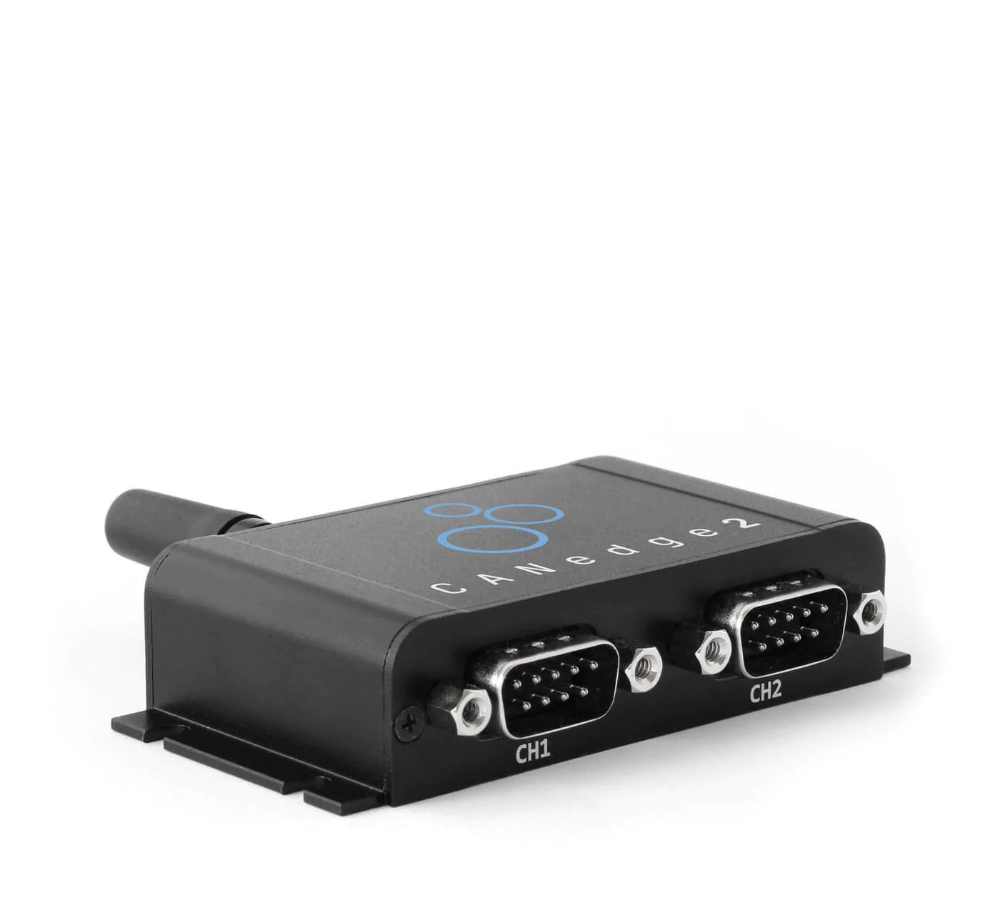

# Background / Context

This repository contains additional tools for working with the [CANEdge 2](https://www.csselectronics.com/products/can-bus-data-logger-wifi-canedge2) data logger.



This device connects to your car's [OBD port](https://en.wikipedia.org/wiki/On-board_diagnostics) to log data.

# Repository / Code

This repository consists of 2 tools:

* A Python script for determining which PIDs your vehicle supports (`determine_supported_pids.py`)
* A Python script for generating the appropriate config file, based on the supported PIDs (`canedge_config_generator.py`) -- last tested with version 01.07 [July 2023]

Both tools should work for your vehicle, as long as your car is newer than 2008. I used these scripts for my 2018 Nissan Versa.

# Step 1: Determining supported PIDs

> Main article: https://en.wikipedia.org/wiki/OBD-II_PIDs

> Main section: https://en.wikipedia.org/wiki/OBD-II_PIDs#Service_01_PID_00_-_Show_PIDs_supported


To determine what OBD2 PIDs your vehicle supports, you'll first have to configure the CanEdge to send the PIDs with ID: 0x00, 0x20, 0x40, 0x60, 0x80, 0xA0, 0xC0. These PIDs return a 4-byte (32-bit) response bitmask that tells you which of next 32 PIDs are enabled.

You can copy the JSON from `transmit_block_for_decoding_pids.md` into your config file. Then, with the CANEdge connected, start your vehicle, and let it run for a few minutes.

Turn the car off, and remove the SD card from the unit.

Next, identify the MF4 file that was saved from this session.

Run the Python script:

```bash
$ python3 determine_supported_pids.py -i <PATH-TO-CANEDGE-MF4-FILE>
```

You should see some output that looks like this:

```
Supported pids
--------------
0x1 1d
0x3 3d
0x4 4d
0x5 5d
0x6 6d
0x7 7d
0xc 12d
0xd 13d
0xe 14d
0xf 15d
0x10 16d
0x11 17d
0x13 19d
0x15 21d
0x1c 28d
0x1f 31d
0x20 32d
0x21 33d
0x24 36d
0x2e 46d
0x2f 47d
0x30 48d
0x31 49d
0x32 50d
0x33 51d
0x3c 60d
0x40 64d
0x41 65d
0x42 66d
0x43 67d
0x44 68d
0x45 69d
0x46 70d
0x47 71d
0x49 73d
0x4a 74d
0x4c 76d
0x4d 77d
0x51 81d
```

This prints the list of supported Service 01 PID IDs. See: https://en.wikipedia.org/wiki/OBD-II_PIDs#Service_01_-_Show_current_data

# Step 2: Generating config file

Now that you have the list of supported PIDs, the next step is to tell your CanEdge to only send commands on those PIDs.

This step involves some manual processing on your end. I recommend making a spreadsheet with columns of: PID number, Message Name, Period, Delay, Response.

I have an example of the spreadsheet in the `docs` folder.

Once you're finished with the spreadsheet, replace the contents of the txt files in the `config_generator` directory with your information.

Then, run the Python script:

```bash
$ python3 canedge_config_generator.py
```

This will output text that you can copy directly into your CanEdge config file, based on the contents of your text files.